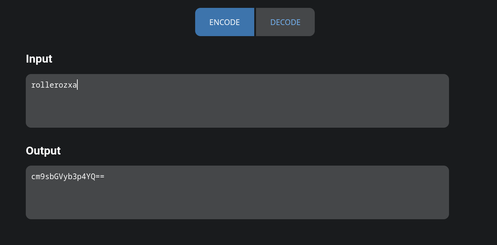

# Base64 Encoder/Decoder



Android Base64 encoder and decoder app. It's tiny. Very tiny.

## Building
Install the Android command-line tools and add `sdk.dir=<SDK PATH>` to a file called local.properties. Then build with Gradle:

```
gradle build
```

